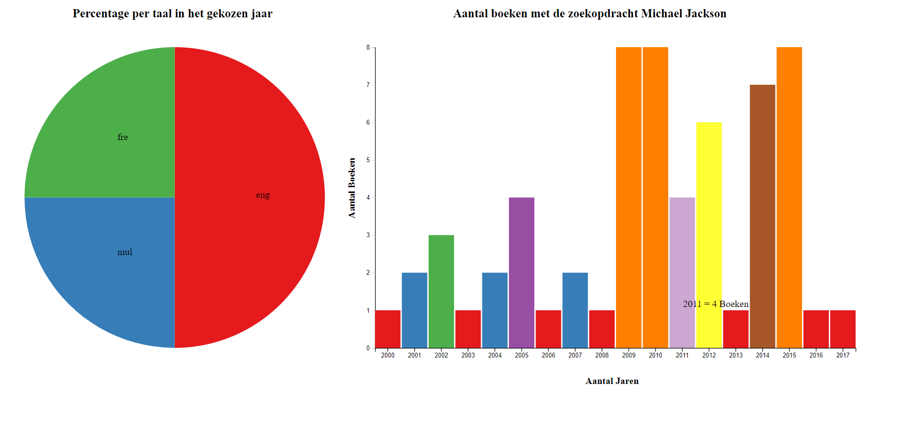
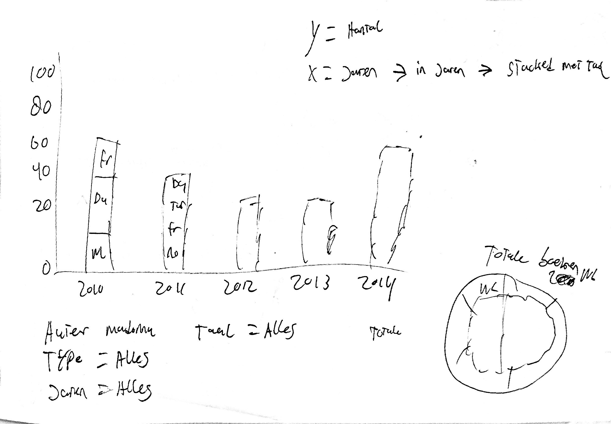
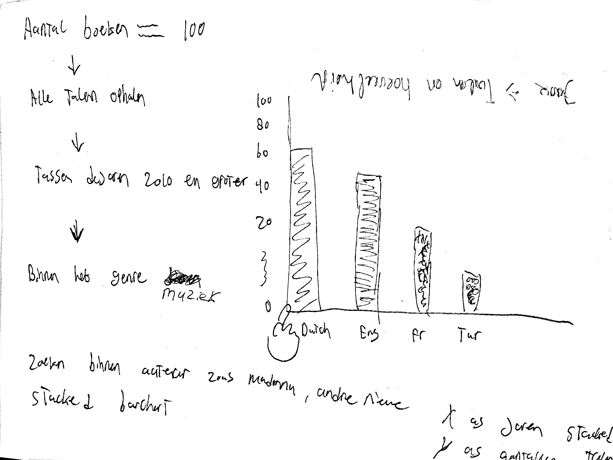

# Oba

https://remcopasma.github.io/frontend-data/
# Inhoud
* 1 | Frontend Data
* 2 | Concept
* 3 | Interactie
* 4 | Problemen
* 5 | Conclusie
* 6 | Schetsen
* 7 | Bronnen
* 8 | Credits

# 1 | Frontend Data
Ik ben begonnen met een express server op te zetten waar ik mijn visualisatie op kan draaien. Ik heb de data opgehaald door de wrapper van wouter te gebruiken. Ik ben gaan kijken naar wat ik wilden onderzoeken en wat ik zou gaan visualiseren. Mijn eerste idee was om 100 boeken op te halen binnen het genre muziek en te kijken welke talen hier het meest in voorkwamen. Na een gesprek met Titus, Jim en Daniel heb ik besloten om hier iets dieper op in te gaan zodat ik ook interactie kan toevoegen.

# 2 | Concept
Ik heb besloten om te zoeken in de query op Michael Jackson en hier alles van op te halen vanaf het jaar 2000. Ik heb hiervoor nodig het jaar van uitgave en de taal. Ik was benieuwd of je kon zien in een visualisatie wanneer Michael Jackson is overleden door de hoeveelheid in een bepaald jaar. Ik heb een barchart gemaak met op de X as het aantal jaar en op de Y as het aantal boeken. Zo hoopte ik dat je daadwerkelijk kon zien vanaf welk jaar het aantal omhoog gaat. Michael Jackson is overleden op 25 juni 2009. In de barchart is ook te zien dat vanaf 2009 het aantal flink omhoog is gegaan en dit tot 2015 vrij hoog is gebleven.

# 3 | Interactie 
Op het moment dat je op een rect klikt in een bepaald jaar krijg je in een piechart de inhoud van de rect te zien. In de rect zitten de talen van de boeken van dat jaar, ik laat dit zien in percentages. Iedere keer als je een nieuwe rect aanklikt wordt de huidgie informatie getoond. Ik wilde weten of de boeken ook in andere talen zijn uitgegeven. De meeste boeken zijn engels en nederlands. Met een aantal franse boeken er af en toe tussen. In de afbeelding hieronder heb ik op 2011 geklikt en toont hij de talen in de piechart en het aantal van een taal in procenten. Bekijk mijn visualisatie hier https://remcopasma.github.io/frontend-data/

# 4 | Problemen
Het grootste probleem waar ik de afgelopen 2 weken tegen aan ben gelopen was het laten zien van de talen door middel van een click. Ik wilde eerst dat als je klikte op een rect dat de rect stacked werd en je op die manier de talen te zien kreeg. Dit is mij uiteindelijk niet gelukt. Toen heb ik besloten om hier een Piechart van te maken. En na het volgen van een tutorial(http://www.tutorialsteacher.com/d3js/create-pie-chart-using-d3js), en wat hulp van Joost was dit mij wel gelukt. 

# 5 | Conclusie
Dit vak is mij beter afgegaan dan functional programming. Ik kon al snel beginnen met het werken met d3 waardoor ik meer tijd had om te spelen met d3. Uit de barchart kun je zien dat michael jackson in 2009 is overleden, want vanaf dat moment stijgt het aantal een aantal jaren flink. Ik heb dus mijn vraag kunnen beantwoorden. Ik ben tevreden met wat ik gemaakt heb en zou als ik meer tijd had gehad wat meer met effecten willen spelen en wat meer informatie willen tonen in de piechart.

# 6 | Schetsen
Ik heb een aantal keer voor mezelf geschets wat ik met de data wilde en wat ik nodig heb om een visualisatie te maken.

# 7 | Bronnen
1. http://www.tutorialsteacher.com/d3js/create-pie-chart-using-d3js 
2. http://www.d3noob.org/2012/12/adding-axis-labels-to-d3js-graph.html 
3. Oba
4. https://blog.risingstack.com/d3-js-tutorial-bar-charts-with-javascript/ 
5. https://en.wikipedia.org/wiki/Michael_Jackson 

# 8 | Credits   
* Joost Flick
* Loc Nguyen

